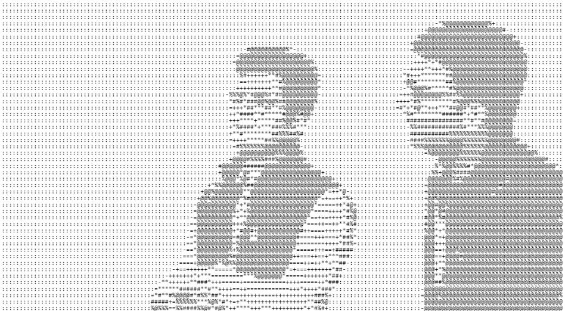
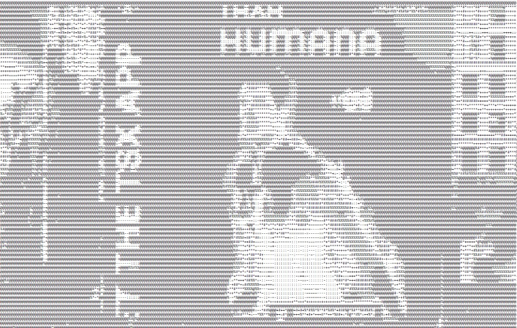
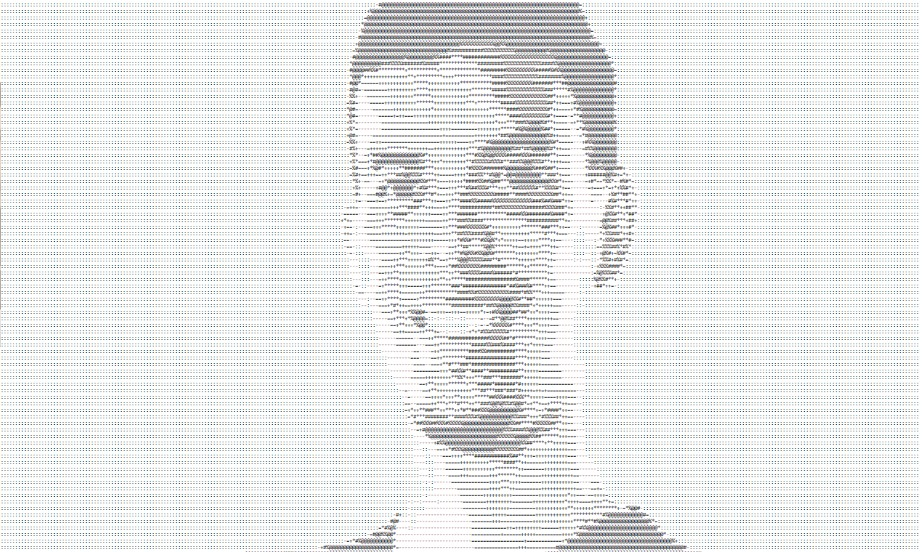

`USE DARK THEME FOR BETTER EXPERIENCE`

<a href="https://github.com/hugomontan/hugomontan">
  <picture>
    <source media="(prefers-color-scheme: dark)" srcset="https://raw.githubusercontent.com/hugomontan/hugomontan/main/dark_mode.svg">
    
  </picture>
</a>

`here is what i look on my daily basis (updated automatically every 4 hours)`

<!--START_SECTION:prices-->
| Bitcoin | Solana | IBOV | S&P 500 | BTG Pactual (rsrs) | USD/BRL |
|:-------:|:------:|:----:|:-------:|:-----------:|:-------:|
| $83716.17 (-1.17%) | $144.61 (+5.08%) | 124365.2 (-0.35%) | 5889.21 (+0.47%) | R$32.1 (+0.19%) | R$5.86 (+0.96%) |
<!--END_SECTION:prices-->

| About me                    | Image                       |
|-----------------------------|-----------------------------|
| I'm an **administration student** at **Inteli**, immersed in **finance** and **cryptoassets**.  I've been active in the **Brazilian crypto ecosystem** since I was **15**, working in **asset management** and **financial research**.  Now, I'm exploring new opportunities in **traditional finance**. |  |

| Languages and previous projects                   | Image                       |
|-----------------------------|-----------------------------|
| Currently, I program in **Python** and **R**, a journey I began at **16 years old**. My primary focus is on **quantitative analysis** of data derived from the **traditional market** and **cryptoassets**, with the goal of supporting **real investment decisions**. |  |

| Fun Fact                          | Image                      |
|-----------------------------------|---------------------------------------|
| I've followed **politics** since age **10**, sparked by **newspapers**. Last year, I faced **legal trouble** for a stunt: placing a **meme of Minister Haddad** on a **Times Square billboard**. It caught attention, and the **Attorney General of the Union** threatened an **investigation**. |  |

| Buddy                        | Image                      |
|-----------------------------|-----------------------------|
| My buddy is Thomaz Klifson, he's in his third year at Inteli, studying computer science. He was also my mentor in the selection process within the Wave Community, a vital part of my approval in the first place. His GitHub: https://github.com/Thomaz-Klifson  |  |

`inteli in 856 characters [3D ASCII]`

